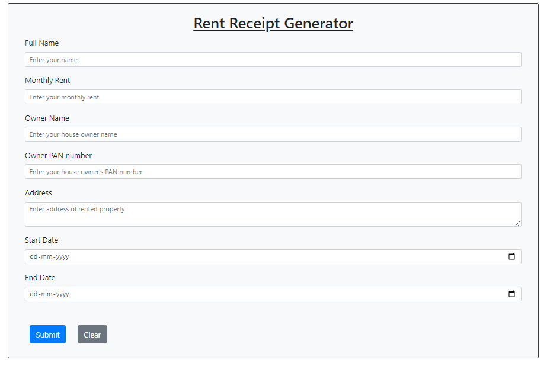

# Rent Receipt Generator

### A [React](https://reactjs.org/) App to generate rent receipts online



> This project was bootstrapped with [Create React App](https://github.com/facebook/create-react-app).

### How to run?

- Clone the repository : `git clone https://github.com/girlCoder8/rent-receipt-generator/`

- Run `yarn install`

- Run `npm run start`

- Open browser and go to `http://localhost:8080/`

**2.** Clone the forked repository.

```bash
git clone https://github.com/<your-github-username>/rent-receipt-generator
```

**3.** Navigate to the project directory.

```bash
cd receipt-generator
```

